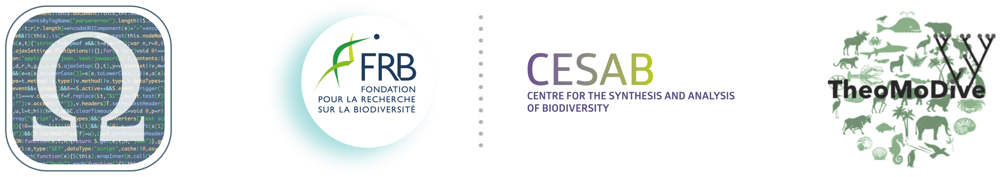

```{r setup, include=FALSE}
knitr::opts_chunk$set(echo = FALSE)
```





<br />


The objective of this five-day workshop, co-organized by the 
[FRB-CESAB](https://www.fondationbiodiversite.fr/en/about-the-foundation/le-cesab/) 
and the 
[GdR TheoMoDive](https://sete-moulis-cnrs.fr/en/research/centre-for-biodiversity-theory-and-modelling/theomodive)
is to train young researchers in theory-based approaches to model ecological data 
(e.g. temporal series, macroecology, interaction and trophic network, etc.).

The second edition of this training course will take place from the 3rd to the 
7th of April 2023 in the CESAB premises in Montpellier.


<br />


## Program

General schedule: 

`08:30-10:45` - Courses<br/>
`10:45-11:00` - _Coffee break_<br/>
`11:00-12:30` - Courses<br/>
`12h30-14:00` - _Lunch_<br/>
`14:00-15:45` - Practices<br/>
`15:45-16:00` - _Coffee break_<br/>
`16:00-17:30` - Practices<br/>
`17:30-18:00` - _Break_<br/>
`18:00-19:00` - Guest speaker


<br/>

**Day 1**

**_Speaker_**: Isabelle Gounand, Sonia Kéfi, and Claire Jacquet

&nbsp;&nbsp;&nbsp;&nbsp;`r fontawesome::fa_i("caret-right")` &nbsp;
Icebreaker and introduction of the week
<br/>&nbsp;&nbsp;&nbsp;&nbsp;`r fontawesome::fa_i("caret-right")` &nbsp;
Introduction to modelling and theory
<br/>&nbsp;&nbsp;&nbsp;&nbsp;`r fontawesome::fa_i("caret-right")` &nbsp;
**_Guest speaker_**: Kim Cuddington (Waterloo Univ., Canada)


<br/>

**Day 2**

**_Speakers_**: Emanuel Fronhofer, Jhelam Deshpande

&nbsp;&nbsp;&nbsp;&nbsp;`r fontawesome::fa_i("caret-right")` &nbsp;
Temporal series and dynamics in ecology
<br/>&nbsp;&nbsp;&nbsp;&nbsp;`r fontawesome::fa_i("caret-right")` &nbsp;
**_Guest speaker_**: Frédéric Barraquand (CNRS, Bordeaux)


<br/>

**Day 3**

**_Speakers_**: Vincent Calcagno, Maxime Dubart

&nbsp;&nbsp;&nbsp;&nbsp;`r fontawesome::fa_i("caret-right")` &nbsp;
Spatial data, macro-ecology and co-occurrences
<br/>&nbsp;&nbsp;&nbsp;&nbsp;`r fontawesome::fa_i("caret-right")` &nbsp;
**_Guest speaker_**: Virginie Ravigné (CIRAD, Montpellier)


<br/>

**Day 4**

**_Speakers_**: François Massol, Claire Jacquet, Matthieu Barbier

&nbsp;&nbsp;&nbsp;&nbsp;`r fontawesome::fa_i("caret-right")` &nbsp;
Interaction networks, trophic networks, and complexity in ecology
<br/>&nbsp;&nbsp;&nbsp;&nbsp;`r fontawesome::fa_i("caret-right")` &nbsp;
**_Guest speaker_**: Sonia Kéfi (CNRS, Montpellier)


<br/>

**Day 5**

&nbsp;&nbsp;&nbsp;&nbsp;`r fontawesome::fa_i("caret-right")` &nbsp;
Subgroups projects


<br/>


## Prerequisites


Please follow this [tutorial](instructions.html) to correctly install your 
working environment (R, RStudio, R packages, etc.).


## Corrections {.appendix}


If you see mistakes or want to suggest changes, please 
[Create an issue](https://github.com/theodatasci/theodatasci.github.io/issues)
on the source repository.


## Reuse {.appendix}


The material of this website is licensed under Creative Commons Attribution 
[CC BY 4.0](https://creativecommons.org/licenses/by/4.0/).
Source code is available at https://github.com/theodatasci/theodatasci.github.io/.


## Citation {.appendix}


Calcagno V, Fronhofer EA, Gounand I, Jacquet C, Kéfi C & Massol F (2023) 
Workshop FRB-CESAB & GdR TheoMoDive: Theory-driven Analysis for Ecological Data (Edition 2023). 
